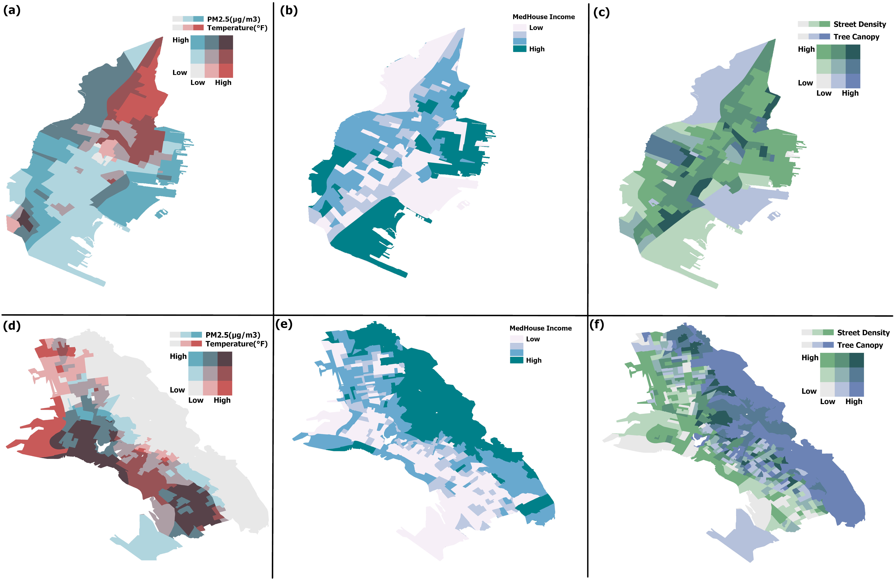

## Welcome!

#### Bio
My name is Mai, and I am a computational science researcher. I use different computational methods to understand the underlying causal mechanisms between urban planning, the built environment, human perception, and the connection of that with the environment. As a side note, I am an avid runner and fencer!

### Research interests

- Data and Urban Environment
- Causal Inference 
- Human Perception
- Human Geography

### Methods

Machine Learning, Deep Learning, Spatial Anlysis, Network Analysis and Causal Inference.

## Projects
### Environmental Hazards Mapping In Major Cities In United States
In this project, we investigated the built environment's impact on clustering hazards in major cities in the United States. Most notably, the infrastructure of streets alongside the tree canopy together contribute to inequitable clusters of hazards where disadvantaged communities exist.

Manuscript: Underreview  

Map of street density and tree canopy in two cities from the sample of cities in the study. On the top is Jersey City, while at the bottom is Oakland City in California.

### Impact of Societal and Environmental Changes on Bike-Sharing Systems
In this project, we explored the causal mechanisms underlying the exposure to air pollution and how this is connected to bike ridership in Boston. Many factors, including the built environment, such as street walkability and the readiness of infrastructure, contribute to increased bike rides -- but on the other hand, people usually ride bikes in areas in city centers, which makes them highly exposed to air pollution. 

Manuscript: Underreview  

## Fellowships

Richard Lowell's public service fellow at Massport Authority: I spent the fellowship with the urban development team at Massport. During my fellowship, I created a dashboard to help in strategic planning for climate change adaptations for their buildings. In this dashboard, I utilized data from different sources to map the distribution of heat, tree canopy, sea level rise, and floor elevation to identify buildings at risk.

[Dashboard](https://www.arcgis.com/apps/dashboards/23c714f5a82b48229705897be7b4252c)

## Education       		
- M.S., Urban Informatics	| Northeastern University (_December 2024_)
- MA., Business Information Systems | 	Cambridge College (_August 2021_)		        		
- BA., Business Information Systems | Cairo University (_May 2016_)
