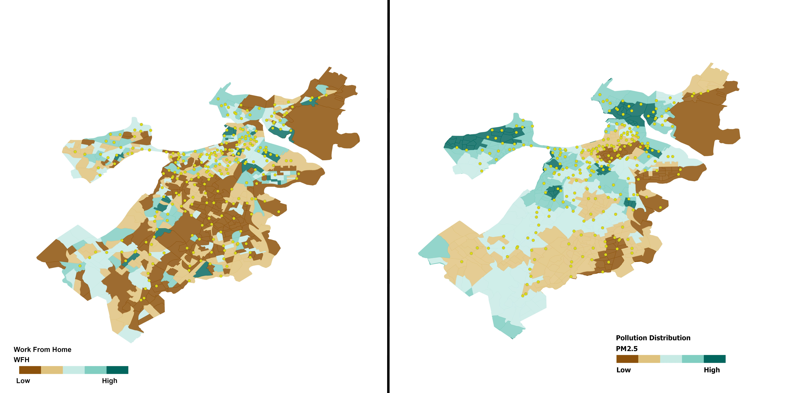

## Welcome!

## Bio
My name is Mai, and I am a computational social science researcher. I use different computational methods to understand the underlying causal mechanisms between urban planning, the built environment, human perception, and the connection of that with the environment. As a side note, I am an avid runner and fencer!

## Research interests

- Data and Urban Environment
- Causal Inference 
- Behvioural Economics 
- Human Geography and Preception

##  Methods

Causal Inference, Machine Learning, Deep Learning, Spatial Analysis and Network Analysis.

***Projects***

Impact of Societal and Environmental Changes on Bike-Sharing Systems:

In this project, we explored the causal mechanisms underlying the exposure to air pollution and how this is connected to bike ridership in Boston. Many factors, including the built environment, such as street walkability and the readiness of infrastructure, contribute to increased bike rides -- but on the other hand, people usually ride bikes in areas in city centers, which makes them highly exposed to air pollution. 

***Policy Implications***

- Public Health: Bike ridership helps reduce emissions; however, cyclists often ride in high-density areas with elevated pollution levels. Interventions are needed to mitigate pollution in areas with high bike usage.
- Accessibility: The uneven spatial distribution of bike stations leads to unequal access. Assessing the demand and need for bike infrastructure is crucial to address these disparities.
- Equity: Marginalized groups often have less access to bike stations in their communities. Inclusive community engagement practices should be prioritized when planning new bike station locations.

Environmental Hazards Mapping In Major Cities In United States:

In this project, we investigated the built environment's impact on clustering hazards in major cities in the United States. Most notably, the infrastructure of streets alongside the tree canopy together contribute to inequitable clusters of hazards where disadvantaged communities exist.

***Policy Implications***

- Equitable Planning: Interventions should be implemented to mitigate exposure to hazards in areas where hazards are concentrated and vulnerable communities reside.
- Public Health: An interdisciplinary approach involving planners, policymakers, and public health experts is essential to address and mitigate such crises.

Map of infrastructure, hazards and income distribution in two cities from the sample of cities in the study. On the top is Jersey City, while at the bottom is Oakland City in California.

## Fellowships

Richard Lowell's public service fellow at Massport Authority: I spent the fellowship with the urban development team at Massport. During my fellowship, I created a dashboard to help in strategic planning for climate change adaptations for their buildings. In this dashboard, I utilized data from different sources to map the distribution of heat, tree canopy, sea level rise, and floor elevation to identify buildings at risk.

[Dashboard](https://www.arcgis.com/apps/dashboards/23c714f5a82b48229705897be7b4252c)

## Education       		
- M.S., Urban Informatics	| Northeastern University (_December 2024_)
- MA., Business Information Systems | 	Cambridge College (_August 2021_)		        		
- BA., Business Information Systems | Cairo University (_May 2016_)
